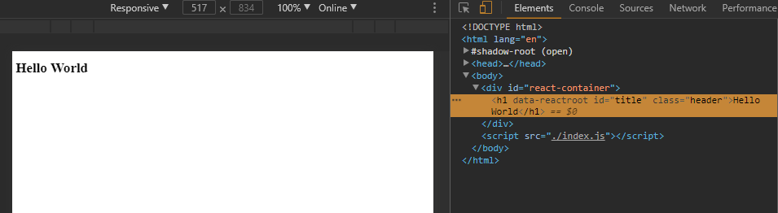

# React under the Hood

A look behind the curtain of React Starters like:

* [create-react-app](https://github.com/facebookincubator/create-react-app)
* [Gatsby.js](https://github.com/gatsbyjs/gatsby)
* [Next.js](https://github.com/zeit/next.js)
* [Neutrino](https://neutrino.js.org)
---

### Table of Content

01. [Pure React](#01-pure-react)
02. [JSX and Babel](02-jsx-and-babel)
03. [Webpack](03-webpack)
04. []()


## 01 Pure React

Create a file */dist/index.js* with the following React code:

```js
const { createElement } = React
const { render } = ReactDOM

const title = createElement(
	'h1',
	{id: 'title', className: 'header'},
	'Hello World'
)

render(
	title,
	document.getElementById('react-container')
)
```

The \<title /\> component uses the createElement function from React to create a h1 header with the css class *header*, an id *title* and a text string *Hello World*.

The ReactDom render function will then render it into the div container with the id *react-container*.

Now we need to create a html page called /dist/index.html that contains the container with named id:

```html
<!DOCTYPE html>
<html lang="en">
<head>
    <script src="https://cdnjs.cloudflare.com/ajax/libs/react/15.1.0/react.min.js"></script>
    <script src="https://cdnjs.cloudflare.com/ajax/libs/react/15.1.0/react-dom.min.js"></script>
    <meta charset="UTF-8">
    <title>Hello World with React</title>
</head>
<body>
    <div id="react-container"></div>
    <script src="./index.js"></script>
</body>
</html>
```

We add React and ReactDOM directly via CDN and link our *index.js* inside the body tag.

Now we need to put our React app onto a webserver - for testing, we will use the npm package httpster to serve our files:

```
npm install httpster -g
```

Now start the webserver with the port and directory flag:

```
httpster -p 3000 -d /e/react-under-the-hood/dist
```

Our app can now be accessed with a webbrowser on *http://localhost:3000*





We can easily style our title component by creating a style component:

```js
const style = {
	backgroundColor: 'purple',
	color: 'teal',
	fontFamily: 'verdana'
}
```

And assigning the style to our component:

```js
const title = createElement(
	'h1',
	{id: 'title', className: 'header', style: style},
	'Hello World'
)
```


## 02 JSX and Babel

React offers a way to write our mark-up directly inside the Javascript component - called JSX. The title component written in JSX looks like this:

```js
render(
	<h1 id = 'title'
			className = 'header'
			style = {style}>
		Hello World
	</h1>,
	document.getElementById('react-container')
)
```

Since our webbrowser don't understand JSX, we will have to transpile it to pure Javascript using Babel - this can be quickly done with the babel-cli transpiler. Let us first initialize our node project by *npm init -y* then install the babel-cli both globally as well as a development dependency inside our project:

```
npm install -g babel-cli

npm install --save-dev babel-cli
```

now create a folder called src inside the root dir and move the index.js file into it - since we want to use Babel to transpile all JSX files from the source directory and copy them to the distribution directory, where they can be picked up and served by our webserver.

Now we need to configure Babel to transpile JSX and all latest and proposed versions of ECMA Script, by adding a file .babelrc inside the root director:

```
{
  'presets': ['latest', 'react', 'stage-0']
}
```

Now we need to install those presets as dev-dependencies:

```
npm install --save-dev babel-preset-react babel-preset-latest babel-preset-stage-0
```

We can now use the cli tool to transpile our JSX source file and create the browser-readable bundle.js file from it:

```
babel ./src/index.js --out-file ./dist/bundle.js
```

Now open index.html inside the /dist directory and change the index.js to bundle.js. Reloading our webserver will now show our app again. To make our life easier we will add the httpster call as our npm start script inside the package.json file - then start your webserver with *npm start*

```
"scripts": {
  "start": "httpster -p 3000 -d ./dist"
}
```


We are now able to write our React code in JSX as well as to use ES2015 or ES2017 syntax inside our source files. Babel will transpile them into browser-friendly code inside /dist/bundle.js.


## 03 Webpack
