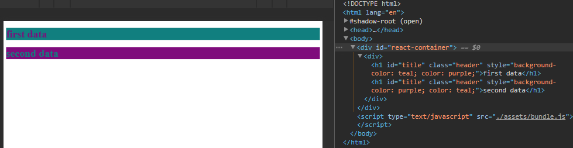
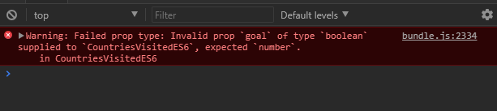

# React under the Hood

A look behind the curtain of React Starters like:

* [create-react-app](https://github.com/facebookincubator/create-react-app)
* [Gatsby.js](https://github.com/gatsbyjs/gatsby)
* [Next.js](https://github.com/zeit/next.js)
* [Neutrino](https://neutrino.js.org)

React is often said to be easy to learn, but impossible to set up in an dev environment. Once you start reading about it, you will be faced by an exhausting amount of choices that you have to make, before you can move on to actual coding. Starter Packages, like the ones named above, give a quick access to the React world. Let's take a look into that black box now.


### Table of Content

01. [Pure React](#01-pure-react)
02. [JSX and Babel](#02-jsx-and-babel)
	* [Transpilation](#transpilation)
03. [Webpack](#03-webpack)
	* [Loading JSON](#loading-json)
	* [Adding SASS](#adding-sass)
04. [React Components](#04-react-components)
	* [ES6 Class Syntax](#es6-class-syntax)
	* [Stateless Functions](#stateless-functions)
05. [Adding React-Icons](#05-adding-react-icons)
06. [Working with Props](#06-working-with-props)
	* [Default Props](#default-props)
	* [PropType Validation](#proptype-validation)
07. [Working with State](#07-working-with-state)


## 01 Pure React

Create a file _/dist/index.js_ with the following React code:

```js
const { createElement } = React
const { render } = ReactDOM

const title = createElement(
	'h1',
	{id: 'title', className: 'header'},
	'Hello World'
)

render(
	title,
	document.getElementById('react-container')
)
```

The \<title /\> component uses the createElement function from React to create a h1 header with the css class _header_, an id _title_ and a text string _Hello World_.

The ReactDom render function will then render it into the div container with the id _react-container_.

Now we need to create a html page called /dist/index.html that contains the container with named id:

```html
<!DOCTYPE html>
<html lang="en">
  <head>
      <meta charset="UTF-8">
      <!-- Force latest available IE rendering engine and Chrome Frame (if installed) -->
  	  <meta http-equiv="X-UA-Compatible" content="IE=edge,chrome=1">
      <!-- Mobile Screen Resizing -->
      <meta name="viewport" content="width=device-width, initial-scale=1.0">
      <!-- HTML5 Shim for IE 6-8 -->
      <!--[if lt IE 9]>
          <script src="http://html5shiv.googlecode.com/svn/trunk/html5.js"></script>
      <![endif]-->
	    <script src="https://cdnjs.cloudflare.com/ajax/libs/react/15.1.0/react.min.js"></script>
	    <script src="https://cdnjs.cloudflare.com/ajax/libs/react/15.1.0/react-dom.min.js"></script>
	    <meta charset="UTF-8">
	    <title>Hello World with React</title>
</head>
<body>
	<!--[if lt IE 8]>
					<section class="container">
							Did you know that your web browser is a bit old? Some of the content on this site might not work right
							as a result. <a href="http://whatbrowser.org">Upgrade your browser</a> for a faster, better, and safer
							web experience.
					</section>
		<![endif]-->
    <div id="react-container"></div>
    <script src="./index.js"></script>
</body>
</html>
```

We add React and ReactDOM directly via CDN and link our _index.js_ inside the body tag.

Now we need to put our React app onto a webserver - for testing, we will use the npm package httpster to serve our files:

```
npm install httpster -g
```

Now start the webserver with the port and directory flag:

```
httpster -p 3000 -d /e/react-under-the-hood/dist
```

Our app can now be accessed with a webbrowser on _http://localhost:3000_


We can easily style our title component by creating a style component:

```js
const style = {
	backgroundColor: 'purple',
	color: 'teal',
	fontFamily: 'verdana'
}
```

And assigning the style to our component:

```js
const title = createElement(
	'h1',
	{id: 'title', className: 'header', style: style},
	'Hello World'
)
```


## 02 JSX and Babel

React offers a way to write our mark-up directly inside the Javascript component - called JSX. The title component written in JSX looks like this:

```js
render(
	<h1 id = 'title'
			className = 'header'
			style = {style}>
		Hello World
	</h1>,
	document.getElementById('react-container')
)
```

Since our webbrowser don't understand JSX, we will have to transpile it to pure Javascript using Babel - this can be quickly done with the babel-cli transpiler. Let us first initialize our node project by _npm init -y_ then install the babel-cli both globally as well as a development dependency inside our project:


### Transpilation

```
npm install -g babel-cli

npm install --save-dev babel-cli
```

now create a folder called src inside the root dir and move the index.js file into it - since we want to use Babel to transpile all JSX files from the source directory and copy them to the distribution directory, where they can be picked up and served by our webserver.

Now we need to configure Babel to transpile JSX and all latest and proposed versions of ECMA Script, by adding a file .babelrc inside the root director:

```
{
  'presets': ['latest', 'react', 'stage-0']
}
```

Now we need to install those presets as dev-dependencies __be advised__: _we later throw out babel-preset-latest babel-preset-stage-0 and replace it with [babel-preset-env](https://babeljs.io/docs/plugins/preset-env/) to work with webpack 3!_ :

```
npm install --save-dev babel-preset-react babel-preset-latest babel-preset-stage-0
```

We can now use the cli tool to transpile our JSX source file and create the browser-readable bundle.js file from it:

```
babel ./src/index.js --out-file ./dist/bundle.js
```

Now open index.html inside the /dist directory and change the index.js to bundle.js. Reloading our webserver will now show our app again. To make our life easier we will add the httpster call as our npm start script inside the package.json file - then start your webserver with _npm start_

```
"scripts": {
  "start": "httpster -p 3000 -d ./dist"
}
```


We are now able to write our React code in JSX as well as to use ES2015 or ES2017 syntax inside our source files. Babel will transpile them into browser-friendly code inside /dist/bundle.js. But now we don't want to do this by hand, every time we made a small edit on our page - we need an automation solution for this process.


## 03 Webpack

Webpak is a module bundler, that enables us to create static files from our React code. We can use it to automate processes like the Babel transpiling and use it to serve our app in an hot-reloading dev-server environment.


First we need to add a [Webpack configuration](https://webpack.js.org/guides/getting-started/) file inside the root directory - webpack.config.js:

```js
const path = require('path');
const webpack = require('webpack');

module.exports = {
  entry: path.resolve(__dirname, './src/index.js'),
  devServer: {
    contentBase: path.resolve(__dirname, './dist'),
    port: 3000,
    inline: true
  },
  module: {
    rules: [{
      test: /\.js$/,
      exclude: /(node_modules)/,
      use: {
        loader: 'babel-loader',
        options: {
          presets: ['env', 'react']
        }
      }
    }]
  },
  output: {
    path: path.resolve(__dirname, './dist/assets/'),
    filename: 'bundle.js',
    publicPath: 'assets'
  },
};
```

Now we want to [install the latest version of Webpack](https://webpack.js.org/guides/installation/) together with the babel-loader & presets, as well as the Webpack Dev-Server to host our files:

```
npm install --save-dev webpack babel-loader babel-core babel-preset-env webpack-dev-server
```

We can create an npm script to start webpack from inside the repository (a global installation is not recommended). The start scripts hosts our webapp, according to the devServer configuration inside webpack.config.js. The build script takes all js files (node_modules excluded), babel-transpiles them with the babel-loader, and puts them bundled into the _./dist/assets_ directory. And the watch script will watch the directories for changes and starts up the loader automatically, when we saved an edit.

```
"scripts": {
	"start": "webpack-dev-server --open",
	"watch": "webpack --watch",
	"build": "webpack --config webpack.config.js"
}
```

We can now run our build process with _npm run build_ / _npm run watch_ and start our devServer with _npm start_.


Let us now use Webpack to load our react dependencies - instead of linking them into our HTML page. To do this we first have to install React to the project:

```
npm install --save react react-dom
```


### Loading JSON

And to demonstrate the function of module loading, we want to use some JSON data, being loaded into our react app by Webpack:

```
npm install --save-dev json-loader
```

Lets add the JSON loader to our Webpack config file:

```js
module: {
	rules: [
		{
			test: /\.js$/,
			exclude: /(node_modules)/,
			use: {
				loader: 'babel-loader',
				options: {
					presets: ['env', 'react']
				}
			}
		},
		{
			test: /\.json$/,
			exclude: /(node_modules)/,
			use: {
				loader: 'json-loader'
			}
		}
	]
},
```

And create a exciting JSON file _./src/title.json_ :

```json
{
  "data1": "first data",
  "data2": "second data"
}
```

And create a JSX module that uses this data in _./src/lib.js_ :

```js
import React from 'react'
import text from './titles.json'

export const data1 = (
  <h1 id='title'
      className='header'
      style={{backgroundColor: 'teal', color: 'purple'}}>
    {text.data1}
  </h1>
)

export const data2 = (
  <h1 id='title'
      className='header'
      style={{backgroundColor: 'purple', color: 'teal'}}>
    {text.data2}
  </h1>
)
```

We are now using the module import statement to import React from the installed React dependency, as well as our own JSON file. This is a function that is not yet integrated in JavaScript but is available thanks to Webpack and Babel. Now we can rewrite our _./src/index.js_ file to receive the module that we just created:

```js
import React from 'react'
import { render } from 'react-dom'
import {data1, data2} from './lib'

render(
	<div>
		{data1}
		{data2}
	</div>,
	document.getElementById('react-container')
)
```

Notice that we need to import _react-dom_ here, since __render__ is not part of _react_.





### Adding SASS

The same principle can be applied to add styles to our react app app - lets try to add some [SASS](http://sass-lang.com/) to our app with the [Kraken-Sass](http://jwebcat.github.io/kraken-sass/index.html) boilerplate:

First we want to install the Webpack loaders for the job of preprocess the source [SASS](http://sass-lang.com/guide) into proper CSS:

```
npm install --save-dev style-loader css-loader sass-loader
```

You will get a warning, that _sass-loader_ requires another dependency called _[node-sass](https://github.com/sass/node-sass)_, which is a library that provides binding for Node.js to LibSass, the C version of the popular stylesheet preprocessor, Sass. This, on the other hand, requires - __under Windows__ - the installation of the [Windows Build Tools](https://github.com/felixrieseberg/windows-build-tools):

```
npm install --g --production windows-build-tools
```


Go and get yourself a cup of coffee - as this is going to take a while ¯\\_(ツ)_\/¯


Once this is through, continue with node-sass:

```
npm install --save-dev node-sass
```

Then add the [SASS loaders](https://webpack.js.org/loaders/sass-loader/) to our Webpack config:

```js
{
	test: /\.scss$/,
	exclude: /(node_modules)/,
	use: [{
					loader: "style-loader" // creates style nodes from JS strings
			}, {
					loader: "css-loader" // translates CSS into CommonJS
			}, {
					loader: "sass-loader" // compiles Sass to CSS
			}]
}
```

[Download the master.zip](https://github.com/jwebcat/kraken-sass/archive/master.zip) from kraken-sass and unzip the kraken.scss file (together with the lib folder - that contains all the scss components) to _./src/assets/sass_.

Now we can import the [kraken-sass styles](http://jwebcat.github.io/kraken-sass/kraken-way.html) into our _./src/index.js_ component:

```js
import React from 'react'
import { render } from 'react-dom'
import {data1, data2} from './lib'
import './assets/sass/kraken.scss'

render(
		<div>
			<h1>Webpack Styling</h1>
			<h4>With Kraken-Sass Boilerplate</h4>
	    <button className="btn btn-blue btn-block"> {data1} </button>
			<button className="btn btn-blue btn-block"> {data2} </button>
  	</div>,
	document.getElementById('react-container')
)
```


As we can see by now - react allows us to create a collection of separate [JSX components](https://reactjs.org/docs/components-and-props.html) and [CSS modules](https://github.com/css-modules/css-modules) that offer isolation to our app logic and component styles. Each piece is a building block, that is then imported into our _./src/index.js_ react interface and bundled & transpiled by Webpack/Babel into a browser-conform website. Lets clean up our folder structure to show the separation between main pages (index.js) and components and modules that can be re-used in every page (make sure to also change the relative links inside each file):


## 04 React Components

Let us now build a small component that list [how many countries] there are in the world, how many we have visited and how much we want to visit in total. We can also add a little bit of math to it and calculate the completion percentage of our endeavor. When you look at code examples on Github, you will find a couple of different ways to write such a component. The first, and oldest one uses the __createClass__ syntax and will no longer work in react v16 - [React 15.5.0: React.createClass officially deprecated](https://facebook.github.io/react/blog/2017/04/07/react-v15.5.0.html#new-deprecation-warnings).


```js
import React from 'react'
import '../assets/sass/kraken.scss'

// cannot be rendered inside react 16 - you need to downgrade your react and reactDom version to react < 15.5

export const CountriesVisited = React.createClass({
	percentToDecimal(decimal) {
		return ((decimal * 100) + '%')
	},
	calcGoalProgress(total, goal) {
		return this.percentToDecimal(total/goal)
	},
	render() {
		return (
			<div className="countries-visited">
        <hr/>
        <h3>The React.createClass Syntax is no longer supported inside React v16!</h3>
				<div className="total-contries">
					<span>{this.props.total} </span>
					<span>total countries</span>
				</div>
				<div className="visited">
					<span>{this.props.visited} </span>
					<span>visited countries</span>
				</div>
				<div className="wish-list">
					<span>{this.props.liked} </span>
					<span>countries on wishlist</span>
				</div>
				<div>
					<span>
						{this.calcGoalProgress(
							this.props.total,
							this.props.goal
						)}
					</span>
				</div>
			</div>
		)
	}
})
```

Here we are working with props (properties) that are passed down from the parent component in _./src/index.js_. That means, if we want to add this component, we also have to inject those properties. If you add the following to the render function inside the parent component (see further below, on how to implement it):

```js
<CountriesVisited total={196}
									visited={86}
									liked={186}
									goal={96}/>
```

and given that you are using react < v16, our component would be rendered inside our main component, just as our buttons did in the example before.

Just in case that you stumble over a code bit somewhere that looks like this... Now lets bring it up to speed and rewrite the component with ES16 syntax!


### ES6 Class Syntax

```js
export class MyComponent extends Component {
		render() {
			return (
				<div>{props.title}</div>
	    )
	  }
	}
```


```js
import { Component } from 'react'

import '../assets/sass/kraken.scss'
import '../assets/sass/ui.scss'

export class CountriesVisitedES6 extends Component {
  percentToDecimal (decimal) {
    return ((decimal * 100) + '%')
  }
  calcTravelProgress (visited, goal) {
    return this.percentToDecimal (visited/goal)
  }
  render() {
    return (
      <div>
        <hr/>

        <div className="grid-full space-bottom text-center">
          <span>{this.props.total} </span>
          <span>total countries </span>
          <Globe className="text-tall" />
        </div>

        <div className="grid-half text-center space-bottom">
          <span>{this.props.visited} </span>
          <span>visited countries </span>
          <Landing className="text-tall" />
        </div>

        <div className="grid-half space-bottom text-center">
          <span>{this.props.liked} </span>
          <span>countries on wishlist </span>
          <Heart className="text-tall" />
        </div>

        <div className="grid-full space-bottom text-center">
          <span>{this.calcTravelProgress (
                    this.props.visited,
                    this.props.goal
                )}
          </span>
          <span> Completion </span>
          <Checked className="text-tall" />
        </div>

        <p className="text-small text-muted">This Data is calculated inside an ES6 Class Component</p>
      </div>
    )
  }
}
```

One thing to point out, is that, written in this ES6 class syntax, we no longer need to wrap our component in parenthesis and the different methods inside the component don't have to be separated by commas anymore. But we can go even one step further and turned it into a Stateless functional component.


### Stateless Functions

Stateless functional component - just as their name implies - are components that are created by a function. They do not have access to state - you cannot use __this__ to access variables. They follow the following structure:

```js
const MyComponent = (props) => (
	<div>{props.title}</div>
)
```

They take in property information from their parent component and return (unrendered) JSX Elements to them. That means, that we also do not have to import react anymore. But local methods - like our calculations - have to be removed from the component and put into their own functions:


```js
import '../assets/sass/kraken.scss'
import '../assets/sass/ui.scss'

const percentToDecimal = (decimal) => {
  return ((decimal * 100) + '%')
}

const calcTravelProgress = (visited, goal) => {
  return percentToDecimal (visited/goal)
}

export const CountriesVisitedStateless = (props) => (

  <div>
    <div className="grid-full space-bottom text-center">
      <span>{props.total} </span>
      <span>total countries</span>
    </div>
    <div className="grid-half text-center space-bottom">
      <span>{props.visited} </span>
      <span>visited countries</span>
    </div>
    <div className="grid-half space-bottom text-center">
      <span>{props.liked} </span>
      <span>countries on wishlist</span>
    </div>
    <div className="grid-full space-bottom text-center">
      <span>{calcTravelProgress (
                props.visited,
                props.goal
            )}
      </span>
      <span> Completion</span>
    </div>
  </div>
)
```

To destructure this a little bit more, we can declaratively state only the object keys that we actually want to use from props - this way we don't have to add the __props.__ in front anymore:

```js
import '../assets/sass/kraken.scss'
import '../assets/sass/ui.scss'

const percentToDecimal = (decimal) => {
  return ((decimal * 100) + '%')
}

const calcTravelProgress = (visited, goal) => {
  return percentToDecimal (visited/goal)
}

export const CountriesVisitedStateless = ({ total, visited, liked, goal }) => (

  <div>
    <hr/>

    <div className="grid-full space-bottom text-center">
      <span>{total} </span>
      <span> total </span>
      <Globe className="text-tall" />
    </div>

    <div className="grid-half text-center space-bottom">
      <span>{visited} </span>
      <span> visited </span>
      <Landing className="text-tall" />
    </div>

    <div className="grid-half space-bottom text-center">
      <span className="text-tall">{liked} </span>
      <span> wishlist </span>
      <Heart className="text-tall" />
    </div>

    <div className="grid-full space-bottom text-center">
      <span>{calcTravelProgress (
                visited,
                goal
            )}
      </span>
      <Checked className="text-tall" /><br/><br/>
    </div>

    <p className="text-small text-muted">This Data is calculated inside a stateless Component</p>

  </div>
)
```


## 05 Adding React Icons

The [React-Icons](http://gorangajic.github.io/react-icons/) module allows you to include popular icons in your React projects. The module can be [installed by npm](https://www.npmjs.com/package/react-icons)

React-Icons can be imported to our component:

```js
import Globe from 'react-icons/lib/go/globe'
import Landing from 'react-icons/lib/md/flight-land'
import Heart from 'react-icons/lib/go/heart'
import Checked from 'react-icons/lib/ti/input-checked'
```

And simply be added to as a child component:

```js
<Globe />
<Landing />
<Heart />
<Checked />
```


## 06 Working with Props

Lets call a new component CountryList inside _./src/index.js_ and give it some props - in form of an array of objects:


```js
<CountryList countries= {
		[
			{
				country: "Japan",
				date: new Date ("10/19/2010"),
				visited: true,
				liked: true
			},
			{
				country: "Taiwan",
				date: new Date ("12/12/2006"),
				visited: true,
				liked: true
			},
			{
				country: "China",
				date: new Date ("10/20/2010"),
				visited: true,
				liked: true
			}
		]
	}/>
```

Now create this component in _./src/components/country-list.js_ :

```js
import Landing from 'react-icons/lib/md/flight-land'
import Heart from 'react-icons/lib/go/heart'

import { CountryRow } from './country-row'

export const CountryList = ({countries}) => (
  <table>
    <thead>
      <tr>
        <th>Date</th>
        <th>Country</th>
        <th>Visited</th>
        <th>Liked</th>
      </tr>
    </thead>

    <tbody>
      {countries.map((country, i) =>
        <CountryRow key={i}
                    country={country.country}
                    date={country.date}
                    visited={country.visited}
                    liked={country.liked}/>
      )}
    </tbody>
  </table>
)
```

We created another nested child component inside to create the actual table body of our country list. All the props that were given to us inside _index.js_ have now be handed further down to the CountryRow component. And we have a map function wrapped around it to go through all values inside the _countries_ array - and create a row for every entry. Which is an excellent time to introduce __The Spread Operator__ - [three dots that changed the world](https://dmitripavlutin.com/how-three-dots-changed-javascript/) - to clean up our code:


```js
export const CountryList = ({countries}) => (
  <div className="grid-full space-bottom space-top">
    <br/><br/>
    <table className="grid-full space-bottom space-top float-center">
      <thead>
        <tr>
          <th>Date</th>
          <th>Country</th>
          <th>Visited</th>
          <th>Liked</th>
        </tr>
      </thead>

      <tbody>
        {countries.map((country, i) =>
          <CountryRow key={i} {...country} />
        )}
      </tbody>
    </table>
  </div>
)
```

And the row component, that we already imported in the list component (above), can now use the props: _country, date, visited, liked_ from the _countries_ array to populate the rows of our table inside _./src/components/countru-row.js_ :

```js
import Landing from 'react-icons/lib/md/flight-land'
import Heart from 'react-icons/lib/go/heart'

export const CountryRow = ({country, date, visited, liked}) => (
  <tr>
    <td>
      { date.getMonth() +1 } / { date.getDate() } / { date.getFullYear() }
    </td>
    <td>
      { country }
    </td>
    <td>
      { (visited) ? <Landing /> : null }
    </td>
    <td>
      { (liked) ? <Heart /> : null }
    </td>
  </tr>
)
```

We added icons again to show, whether we visited and liked a country. The syntax of the [Inline If-Else Statement](https://reactjs.org/docs/conditional-rendering.html#inline-if-else-with-conditional-operator) __(visited) ? \<Landing /\> : null__ reads like: _if visited is true, display the Landing react-icon, otherwise, don't_.


### Default Props

Default props populate our child component with properties, when they are not provided by the parent component. Lets add them to our country-visited component, to see how this looks like for the createClass syntax, the ES6 Class syntax and inside a stateless component:


__createClass__ (see _.src/components/countries-visited-createClass.js_)

The default props are just added like our custom methods before inside the component, by the __getDefaultProps__ function:

```js
export const CountriesVisited = React.createClass({
	getDefaultProps() {
		return {
			total : 196,
			visited : 50,
			liked : 100,
			goal : 99
		}
	}, [...] })
```


__ES6 Class__ (see _.src/components/countries-visited-ES6.js_)

In case of an ES6 class we have to add default props to the class instance (written below the component itself):

```js
CountriesVisitedES6.defaultProps = {
    total : 196,
    visited : 50,
    liked : 100,
    goal : 99
}
```


__stateless__ (see _.src/components/countries-visited-stateless.js_)

the way above can also be used for stateless components - just copy&paste. But you can also assign default values to the props that you give the component - they will only be used if no props are provided by the parent component:

```js
export const CountriesVisitedStateless = ({ total=196, visited=50, liked=100, goal=99 }) => ([...])
```


### PropType Validation

As your app grows, you can catch a lot of bugs with typechecking. To run typechecking on the props for a component, you can assign the special [propTypes property](https://reactjs.org/docs/typechecking-with-proptypes.html):


__createClass__ (see _.src/components/countries-visited-createClass.js_)

```js
import { createClass, PropTypes } from 'react'

export const CountriesVisited = React.createClass({
	propTypes() {
		total : propTypes.number,
		visited : propTypes.number,
		liked : propTypes.number,
		goal : propTypes.number
	}, [...] })
```


__ES6 Class__ (see _.src/components/countries-visited-ES6.js_)

In case of an ES6 class we have to add propsTypes to the class instance (written below the component itself). For React >15.5 we also need to install _npm install --save prop-types_ separately and import it at the top of the file !

```js
import { Component } from 'react'
import PropTypes from 'prop-types';

[...]

CountriesVisitedES6.defaultProps = {
	total : propTypes.number.isRequired,
	visited : propTypes.number.isRequired,
	liked : propTypes.number,
	goal : propTypes.number.isRequired
}
```

You can test it by "feeding" your component, e.g. a Boolean instead of a Number - you will now get an error message inside your console (the same would happen, if you remove a prop that is tagged as __.isRequired__):





__stateless__ (see _.src/components/countries-visited-stateless.js_)

the way above can also be used for stateless components - just copy&paste:

```js
import PropTypes from 'prop-types';

[...]

CountriesVisitedES6.defaultProps = {
	total : propTypes.number.isRequired,
	visited : propTypes.number.isRequired,
	liked : propTypes.number,
	goal : propTypes.number.isRequired
}
```

We can now add Type Validation to our two list / row components:

__stateless__ (see _.src/components/country-row.js_)

```js
import PropTypes from 'prop-types';

[...]

CountryRow.propTypes = {
    country: PropTypes.string.isRequired,
    date: PropTypes.instanceOf(Date).isRequired,
    visited: PropTypes.bool,
    liked: PropTypes.bool,
}
```

__stateless__ (see _.src/components/country-list.js_)

```js
import PropTypes from 'prop-types';

[...]

CountryList.propTypes = {
    countries: PropTypes.array.isRequired,
}
```

Beside those default Type Checks, we can also employ __Custom Validations__ - e.g. is _countries_ an array, or does the array _countries_ have at least 1 entry:

```js
CountryList.propTypes = {
    countries: function(props) {
			if(!Array.isArray(props.countries)) {
				return new Error (
					"Country List has to be an Array!"
				)
			} else if (!props.countries.length) {
          return new Error (
            "Country List must have at least one record!"
          )
      } else {
          return null
      }
		}
}
```


## 07 Working with State


.
